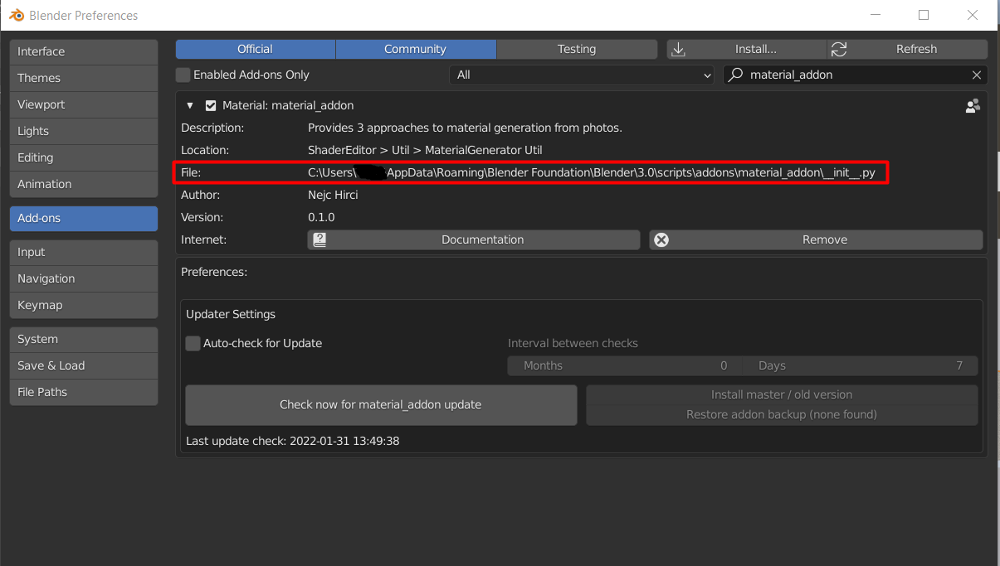

# Material-Addon

Source repository for the development of Blender addon for the 
user study of different material systems.

## Installation

1. Download latest release material_addon.zip and install as zip in Blender.
2. You will need to create a python environment in the installed addon folder, which can be found in Blender Preferences > Add-ons (copy without __init__.py). Portable Blender doesn't come with python so you will have to install Python 3.9 separately and use it to create a virtual environment in a similar fashion:

    1. Next open CMD and use `cd "<YOUR_PATH>\Blender Foundation\Blender 3.0\3.0\python\bin"` to enter the python installation Blender directory.
    2. Now we will create a virtual environment by running with the add-on installation path copied from earlier `./python.exe -m venv "<ADD_ON_PATH>"`.
    3. Next we will go to the material_addon installation directory wiht `cd "<ADD_ON_PATH>"` and run `./venv/Scripts/activate` to activate the environment.
4. Install appropriate version of PyTorch for your system to the created environment.
    1. To install PyTorch on a CUDA supported gpu (see https://developer.nvidia.com/cuda-gpus for support) you must download CUDA toolkit from [here](https://developer.nvidia.com/cuda-toolkit). This will install v11 CUDA drivers on your system.
    2. Next we will install PyTorch by running `pip install torch==1.10.2+cu113 torchvision==0.11.3+cu113 torchaudio===0.10.2+cu113 -f https://download.pytorch.org/whl/cu113/torch_stable.html
` in the previously opened CMD. 
5. Install the required packages from (requirements.txt)[requirements.txt] by running `pip install -r requirements.txt`
6. Installation is now complete and should enable you to use all 3 implemented material approaches.

## Demo usage

NeuralMaterial and Algorithmic approach support a photo of any resolution of format .png.
For MaterialGAN approach you must print the apriltags preprepared [IMAGE](docs/tag36h11_print.png) and take flash photos of material
inside the cut region.

When taking more photos of the material be sure to keep the target material as centered as possible and try to vary between different 
angles, otherwise you may experience a overblown generated material from NeuralMaterial and MaterialGAN approaches.

1. In Blender go to `MaterialGenerator` view. You can see the implemented addon as an extra tab in the `ShaderNode` view.

2. You can choose between different material generation and editing approaches in the top enum of addon user interface:

- [MaterialGAN approach](https://github.com/tflsguoyu/materialgan) with added editing step with help from [SeFa research paper](https://github.com/genforce/sefa) and a superresolution step from [LIIF](https://github.com/yinboc/liif):
    1. First you must select a directory with at least 9 images of material with the printed apriltags paper.
    2. Format the images.
    3. Select number of images and number of epochs and generate material (may take 1min-5min depending on the CUDA supported GPU in the system). You can pause the generation at any time by pressing pause button.
    4. To edit you must generate interpolations in GAN space and choose by clicking below the interpolations to move in the desired direction.
    5. As a last step you can upscale the material to the chosen resolution.

- [NeuralMaterial approach](https://github.com/henzler/neuralmaterial) with editing in chosen material directions:
    1. First you must select a directory with any number of photos of the material.
    2. Then you can choose the number of images and epochs to be used in generation and the desired resolution and start the generation process. You can pause the generation at any time by pressing pause button.
    3. As a last step you can generate interpolations between generated and chosen materials and edit by clicking below the images.

- [Algorithmic approach](https://github.com/cgvirus/photo-to-pbr-texture-blender) with editing in chosen material directions from BlenderKit 
    1. First you must select a directory with one image of the material.
    2. Then you can generate the desired material inside Blender. This will freeze Blender because the rendering of texture maps cannot be performed in the bacground (should not take more then 30s).
    3. As a last step you can choose to interpolate the material between the downloaded BlenderKit materials and genereted material. 

