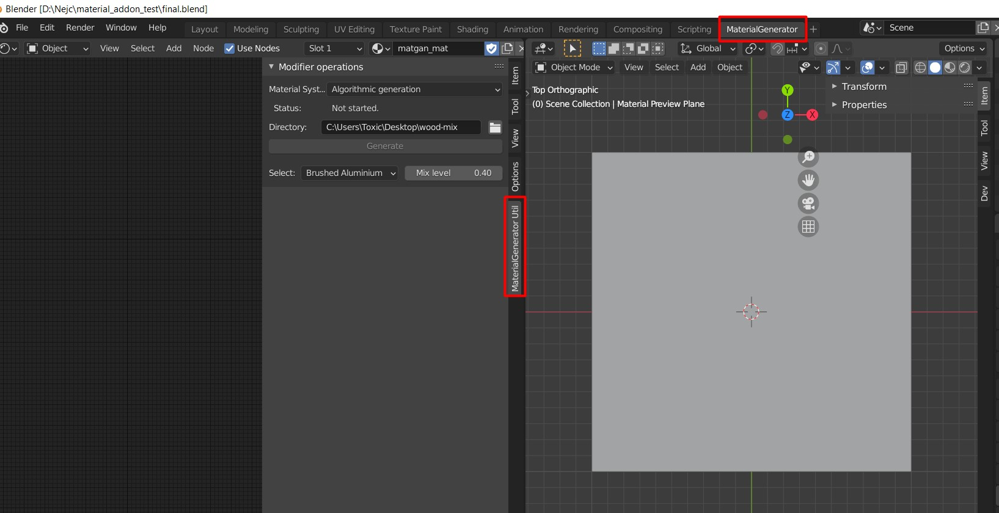
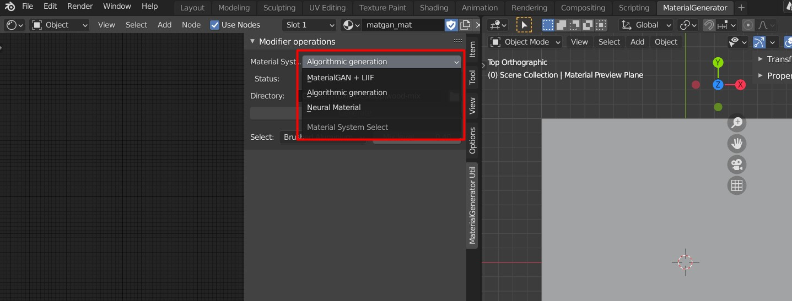
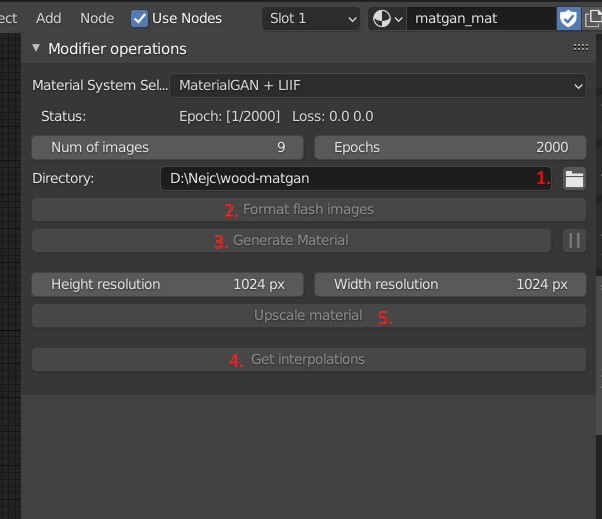
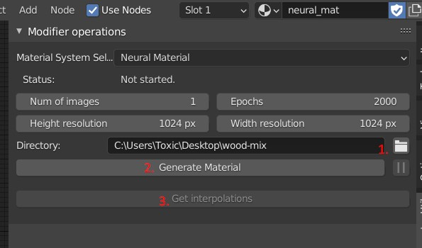
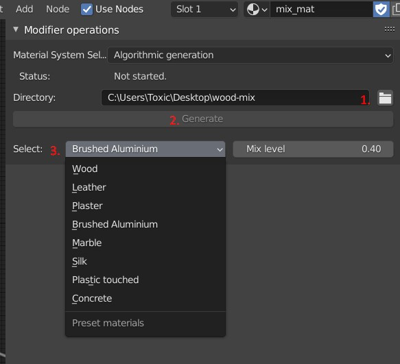

# Material-Addon

Source repository for the development of Blender addon for the 
user study of different material systems.

## Installation

1. Download latest release material_addon.zip and install as zip in Blender.
2. Afterwards you must create python envrionment in addon installation directory under `venv` folder from requirements.txt
3. Install appropriate version of PyTorch for your system to the created environment.

## Demo usage

1. Extract Blender from demo zip folder and run it.
2. Open demo blender file `final.blender` from the extracted folder.
3. In Blender go to `MaterialGenerator` view. You can see the implemented addon as an extra tab in the `ShaderNode` view.

4. You can choose between different material generation and editing approaches in the top enum of addon user interface:

- [MaterialGAN approach](https://github.com/tflsguoyu/materialgan) with added editing step with help from [SeFa research paper](https://github.com/genforce/sefa) and a superresolution step from [LIIF](https://github.com/yinboc/liif):
    1. First you must select a directory with at least 9 images of material with the printed apriltags paper.
    2. Format the images.
    3. Select number of images and number of epochs and generate material (may take 1min-5min depending on the CUDA supported GPU in the system). You can pause the generation at any time by pressing pause button.
    4. To edit you must generate interpolations in GAN space and choose by clicking below the interpolations to move in the desired direction.
    5. As a last step you can upscale the material to the chosen resolution.

- [NeuralMaterial approach](https://github.com/henzler/neuralmaterial) with editing in chosen material directions:
    1. First you must select a directory with any number of photos of the material.
    2. Then you can choose the number of images and epochs to be used in generation and the desired resolution and start the generation process. You can pause the generation at any time by pressing pause button.
    3. As a last step you can generate interpolations between generated and chosen materials and edit by clicking below the images.

- [Algorithmic approach](https://github.com/cgvirus/photo-to-pbr-texture-blender) with editing in chosen material directions from BlenderKit 
    1. First you must select a directory with one image of the material.
    2. Then you can generate the desired material inside Blender. This will freeze Blender because the rendering of texture maps cannot be performed in the bacground (should not take more then 30s).
    3. As a last step you can choose to interpolate the material between the downloaded BlenderKit materials and genereted material. 

